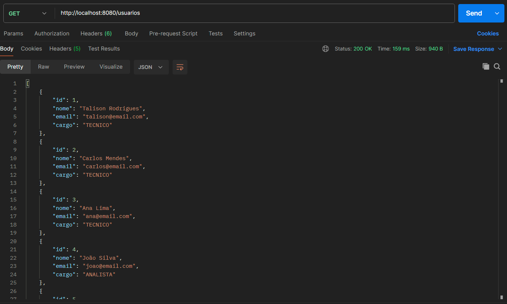
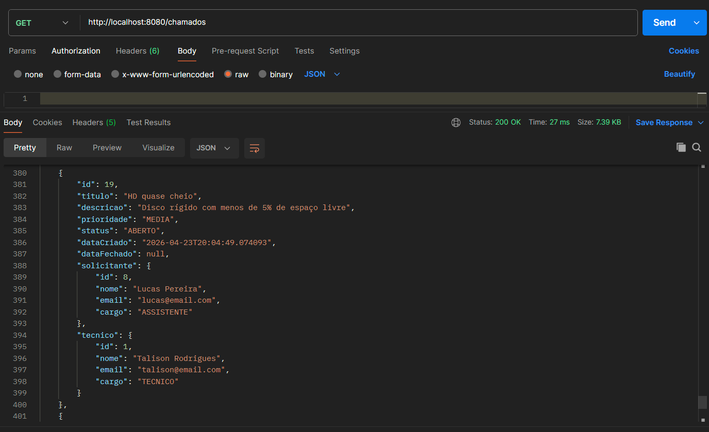
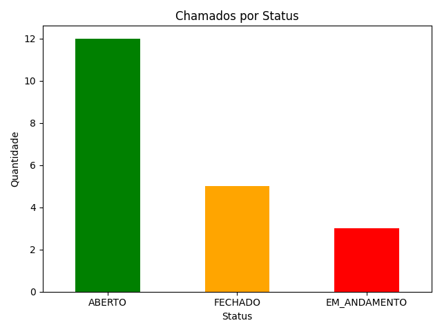
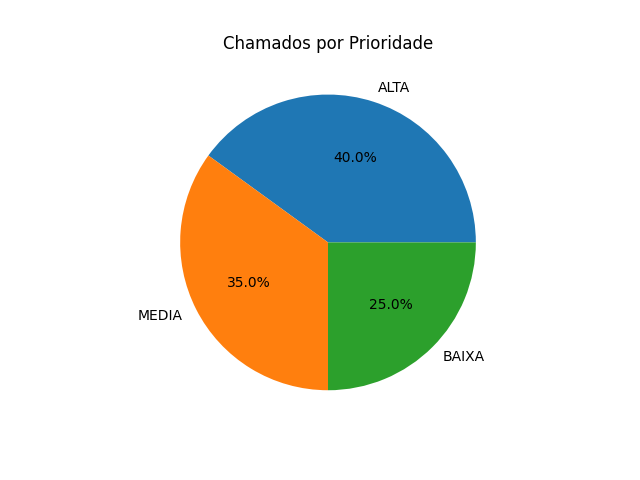
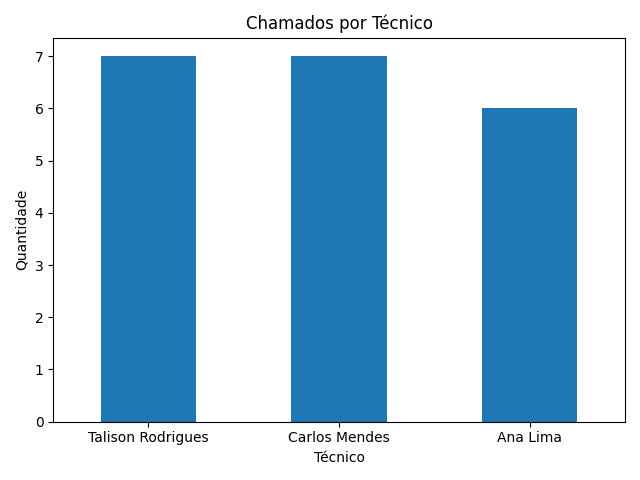

# 🎫 Helpdesk API

API REST para gerenciamento de chamados de suporte técnico.

O projeto simula um ambiente real de helpdesk, incluindo regras de negócio, gestão de usuários e análise de dados dos atendimentos, permitindo visualizar padrões e desempenho da equipe técnica.

## 📸 Screenshots

### API
<p>
    
    
</p>

### Análise de Dados
<p>
    
    
    
</p>

## 🛠️ Tecnologias

- **Java 21**
- **Spring Boot 3.5.1**
- **Spring Data JPA**
- **H2 Database**
- **Lombok**
- **Maven**
- **Python 3.13** *(análise de dados)*

## 📁 Estrutura do Projeto
```
src/main/java/com/helpdesk/helpdesk_api/
├── controller/
│   ├── ChamadoController.java
│   └── UsuarioController.java
├── service/
│   ├── ChamadoService.java
│   └── UsuarioService.java
├── repository/
│   ├── ChamadoRepository.java
│   └── UsuarioRepository.java
├── model/
│   ├── Chamado.java
│   └── Usuario.java
└── enums/
    ├── Cargo.java
    ├── Prioridade.java
    └── Status.java
    
analytics/
├── analise.py
└── *.png
```

## ⚙️ Como Rodar o Projeto

### Pré-requisitos
- Java 21+
- Maven
- Python 3.13+

### Passos
```bash
# Clone o repositório
git clone https://github.com/TalisonAzzini/helpdesk-api.git

# Entre na pasta
cd helpdesk-api

# Rode a aplicação
./mvnw spring-boot:run
```

A aplicação sobe em http://localhost:8080

### 🗄 Console do Banco H2
Acesse http://localhost:8080/h2-db
- **JDBC URL:** `jdbc:h2:mem:helpdesk`
- **User:** `sa`
- **Password:** *(vazio)*

## 📊 Análise de Dados
Com a API rodando, execute o script:

```bash
cd analytics
python analise.py
```

A análise permite identificar:

- Volume de chamados por status
- Distribuição de prioridades
- Carga de trabalho por técnico

## 📋 Endpoints

### Usuários
| Método | Rota | Descrição |
|---|---|---|
| POST | `/usuarios` | Cadastra um novo usuário |
| GET | `/usuarios` | Lista todos os usuários |
| GET | `/usuarios/{id}` | Busca usuário por ID |
| PUT | `/usuarios/{id}` | Atualiza um usuário |
| DELETE | `/usuarios/{id}` | Remove um usuário |

### Chamados
| Método | Rota | Descrição |
|---|---|---|
| POST | `/chamados` | Abre um novo chamado |
| GET | `/chamados` | Lista todos os chamados |
| GET | `/chamados/{id}` | Busca chamado por ID |
| PUT | `/chamados/{id}?tecnicoId={id}` | Atualiza um chamado |
| DELETE | `/chamados/{id}` | Remove um chamado |

## 📝 Exemplos de Requisição

### Cadastrar Usuário
```json
POST /usuarios
{
    "nome": "Nome do Tecnico",
    "email": "tecnicon@email.com",
    "cargo": "TECNICO"
}
```

### Abrir Chamado
```json
POST /chamados
{
    "titulo": "Chamado de Suporte",
    "descricao": "Problema com o sistema",
    "prioridade": "MEDIA",
    "tecnico": { "id": 1, "cargo": "TECNICO" },
    "solicitante": { "id": 2 }
}
```

### Cargos disponíveis
`TECNICO` `ASSISTENTE` `ANALISTA` `SUPERVISOR` `GERENTE` `DIRETOR`

### Prioridades disponíveis
`BAIXA` `MEDIA` `ALTA`

### Status disponíveis
`ABERTO` `EM_ANDAMENTO` `FECHADO`

## 🔒 Regras de Negócio

- Apenas usuários com cargo `TECNICO` podem ser atribuídos como técnicos em chamados
- O status inicial de todo chamado é definido como `ABERTO` automaticamente
- A `dataCriado` é preenchida automaticamente na criação
- A `dataFechado` é preenchida automaticamente quando o status é alterado para `FECHADO`

## 🚀 Futuras Implementações

- [ ] Autenticação e autorização com Spring Security + JWT
- [x] Análise de dados com Python
- [ ] Paginação nas listagens
- [ ] Filtros por status e prioridade

## 👨‍💻 Autor

**Talison Rodrigues Azzini Lopes**
- LinkedIn: [linkedin.com/in/talisonazzini](https://linkedin.com/in/talisonazzini)
- GitHub: [github.com/TalisonAzzini](https://github.com/TalisonAzzini)
