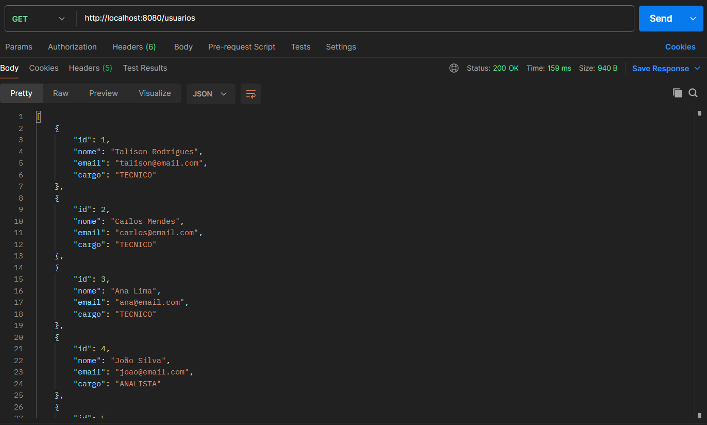
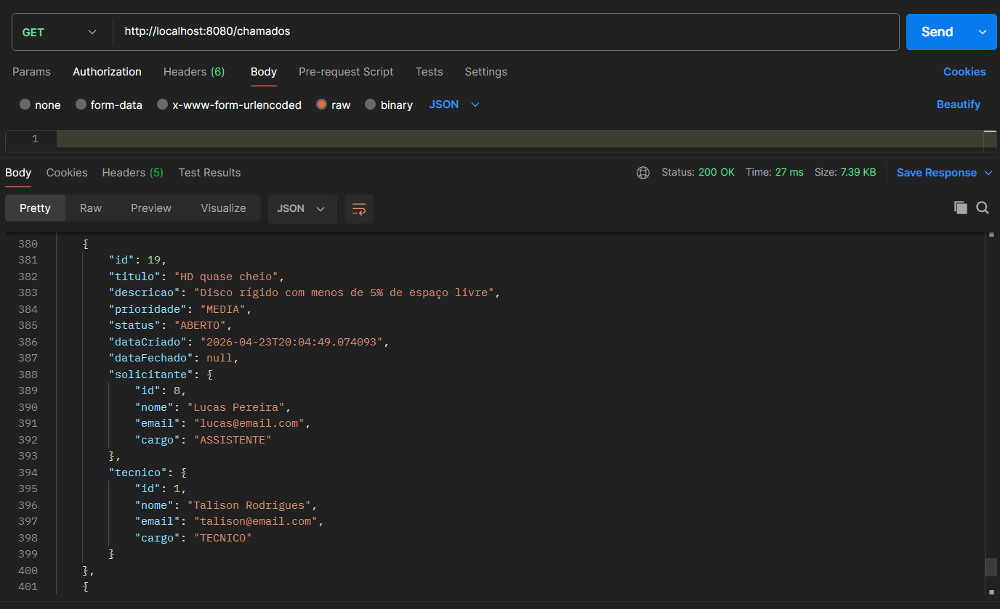
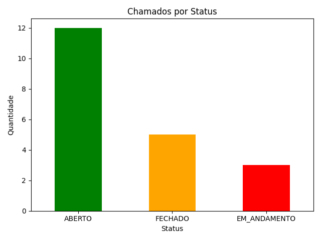
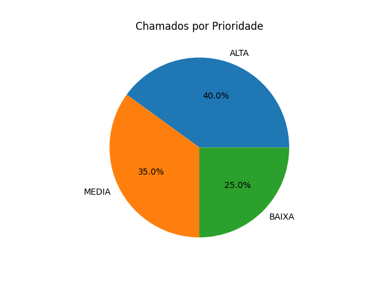
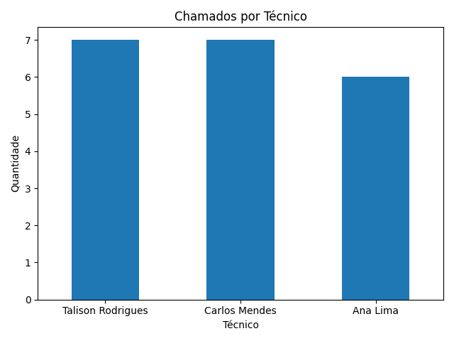

# 🎫 Helpdesk API

API REST para gerenciamento de chamados de suporte técnico, desenvolvida com Java e Spring Boot.

O projeto foi desenvolvido com base em um cenário real de helpdesk, simulando fluxos de atendimento, atribuição de técnicos e controle de status, além de incluir análise de dados para extração de insights operacionais.

## ✨ Diferenciais

- Autenticação segura com Spring Security + JWT
- Arquitetura em camadas (Controller, Service, Repository)
- Regras de negócio aplicadas (ex: restrição de técnicos)
- Integração com análise de dados em Python
- Simulação de ambiente real de suporte técnico

## 📸 Screenshots

### API
<p>
    
    
</p>

### Análise de Dados
<p>
    
    
    
</p>

## 🛠️ Tecnologias

- **Java 21**
- **Spring Boot 3.5.1**
- **Spring Security + JWT** *(autenticação e autorização)*
- **Spring Data JPA**
- **H2 Database** *(ambiente de desenvolvimento)*
- **Lombok**
- **Maven**
- **Python 3.13** *(análise de dados)*
- **Pandas** *(manipulação de dados)*
- **Matplotlib** *(visualização de dados)*

## 🧠 Arquitetura

O projeto segue o padrão de arquitetura em camadas:

- **Controller** — recebe as requisições HTTP
- **Service** — contém as regras de negócio
- **Repository** — responsável pelo acesso ao banco de dados
- **Model** — define as entidades da aplicação
- **DTOs** — separa os dados de entrada/saída das entidades
- **Infra** — segurança, tratamento de exceções e inicialização da aplicação

Essa separação garante melhor organização, manutenção e escalabilidade do sistema.

## 📁 Estrutura do Projeto

```text
src/main/java/com/helpdesk/helpdesk_api/
├── controllers/    # Camada de entrada (REST endpoints)
├── services/       # Regras de negócio
├── repositories/   # Persistência de dados (JPA)
├── models/         # Entidades do sistema
├── dtos/           # Objetos de transferência de dados
├── enums/          # Tipos fixos (status, prioridade, cargo)
└── infra/
    ├── security/   # Configurações de autenticação e autorização
    ├── exceptions/ # Tratamento global de exceções
    └── DataInitializer.java  # Inicialização de dados padrão

analytics/
├── analise.py
└── *.png
```

## ⚙️ Como Rodar o Projeto

### Pré-requisitos
- Java 21+
- Maven
- Python 3.13+

### Passos
```bash
# Clone o repositório
git clone https://github.com/TalisonAzzini/helpdesk-api.git

# Entre na pasta
cd helpdesk-api

# Rode a aplicação
./mvnw spring-boot:run
```

A aplicação sobe em `http://localhost:8080`

### 🗄 Console do Banco H2
Acesse `http://localhost:8080/h2-db`
- **JDBC URL:** `jdbc:h2:mem:helpdesk`
- **User:** `sa`
- **Password:** *(vazio)*

### 🔑 Usuário padrão
Ao iniciar a aplicação, um usuário ROOT é criado automaticamente:
- **Email:** `root@helpdesk.com`
- **Senha:** `root123`

> ⚠️ Recomenda-se criar um usuário ADM e não utilizar o ROOT diretamente.

## 📊 Análise de Dados

Com a API rodando e chamados cadastrados, execute o script Python para gerar os gráficos:

```bash
cd analytics
python analise.py
```

A análise de dados permite extrair insights relevantes do sistema, como:

- Volume de chamados por status
- Distribuição de prioridades
- Carga de trabalho por técnico

Essas informações simulam indicadores utilizados em ambientes reais de suporte para tomada de decisão.

| Gráfico | Tipo | O que mostra |
|---|---|---|
| Chamados por Status | Barras | Volume de chamados em cada etapa do atendimento |
| Chamados por Prioridade | Pizza | Distribuição percentual das prioridades |
| Chamados por Técnico | Barras | Carga de trabalho individual da equipe |

## 📋 Endpoints

### Autenticação
| Método | Rota | Descrição | Auth |
|---|---|---|---|
| POST | `/auth/login` | Realiza login e retorna token JWT | ❌ |
| POST | `/auth/cadastrar` | Cadastra novo usuário | ✅ |

### Usuários
| Método | Rota | Descrição | Auth |
|---|---|---|---|
| GET | `/usuarios` | Lista todos os usuários | ✅ |
| GET | `/usuarios/{id}` | Busca usuário por ID | ✅ |
| PUT | `/usuarios/{id}` | Atualiza um usuário | ✅ |
| DELETE | `/usuarios/{id}` | Remove um usuário | ✅ |

### Chamados
| Método | Rota | Descrição | Auth |
|---|---|---|---|
| POST | `/chamados` | Abre um novo chamado | ✅ |
| GET | `/chamados` | Lista todos os chamados | ✅ |
| GET | `/chamados/{id}` | Busca chamado por ID | ✅ |
| PUT | `/chamados/{id}?tecnicoId={id}` | Atualiza um chamado | ✅ |
| DELETE | `/chamados/{id}` | Remove um chamado | ✅ |

> ✅ Requer token JWT no cabeçalho: `Authorization: Bearer {token}`

## 📝 Exemplos de Requisição

### Login
```json
POST /auth/login
{
    "email": "root@helpdesk.com",
    "senha": "root123"
}
```

### Cadastrar Usuário
```json
POST /auth/cadastrar
{
    "nome": "Nome do Tecnico",
    "email": "tecnico@email.com",
    "senha": "senha123",
    "cargo": "TECNICO"
}
```

### Abrir Chamado
```json
POST /chamados
{
    "titulo": "Chamado de Suporte",
    "descricao": "Problema com o sistema",
    "prioridade": "MEDIA",
    "tecnico": { "id": 1 },
    "solicitante": { "id": 2 }
}
```

### Cargos disponíveis
`ROOT` `ADM` `TECNICO` `ASSISTENTE` `ANALISTA` `SUPERVISOR` `GERENTE` `DIRETOR`

### Prioridades disponíveis
`BAIXA` `MEDIA` `ALTA`

### Status disponíveis
`ABERTO` `EM_ANDAMENTO` `FECHADO`

## 🔒 Regras de Negócio

A API implementa regras que simulam um ambiente real de suporte técnico:

- Chamados possuem status (`ABERTO`, `EM_ANDAMENTO`, `FECHADO`)
- Chamados possuem níveis de prioridade (`BAIXA`, `MEDIA`, `ALTA`)
- Apenas usuários com perfil de técnico podem atender chamados
- Controle de acesso baseado em roles (`ROLE_ADM`, `ROLE_TECNICO`, etc.)
- Autenticação com Spring Security + JWT — todas as rotas exceto `/auth/login` exigem token válido
- Usuário ROOT criado automaticamente na inicialização da aplicação para acesso inicial
- Email duplicado não é permitido no cadastro
- Senha nunca retornada nas respostas da API
- `dataCriado` preenchida automaticamente na criação do chamado
- `dataFechado` preenchida automaticamente ao fechar o chamado

Essas regras garantem maior realismo e aproximam o projeto de um cenário corporativo.

## 🚀 Futuras Implementações

- [x] Análise de dados com Python
- [x] Autenticação e autorização com Spring Security + JWT
- [ ] Banco de dados persistente (PostgreSQL)
- [ ] Paginação nas listagens
- [ ] Filtros por status e prioridade

## 👨‍💻 Autor

**Talison Rodrigues Azzini Lopes**
- LinkedIn: [linkedin.com/in/talisonazzini](https://linkedin.com/in/talisonazzini)
- GitHub: [github.com/TalisonAzzini](https://github.com/TalisonAzzini)